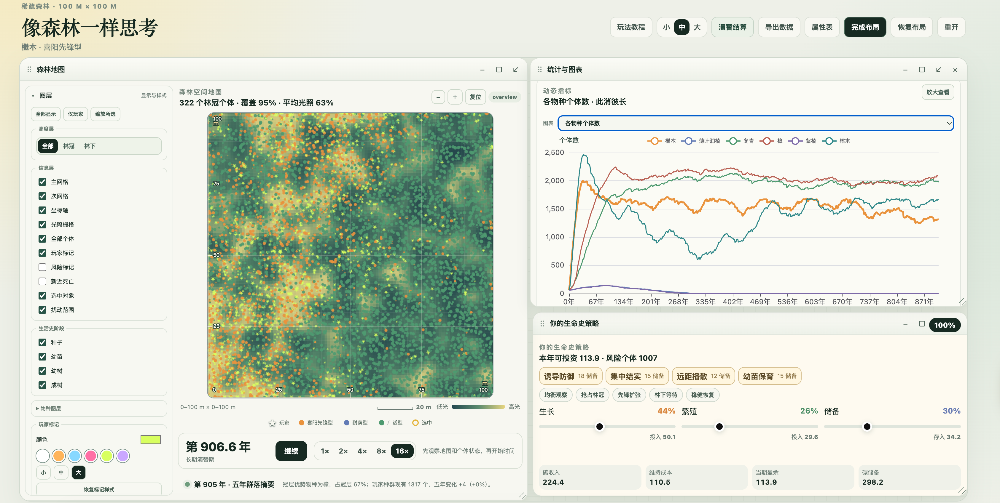

# Think Like a Forest

[简体中文](README.md) | English

> Life moves forward through trade-offs. We cannot have everything at once. A high salary may cost us time, intensity, and health; choosing comfort today may leave us wondering tomorrow why we did not begin sooner.
>
> Life in a forest is no different. Every investment in growth, reproduction, or reserves closes off another possibility. This game asks you to think at the scale of a forest: reach upward for light, gamble on the next generation, or save strength for the unknown?
>
> *To be or not to be*—the real question is rarely whether to choose, but what price you are willing to pay for that choice.

## Screenshot



**Think Like a Forest** is a browser-based, single-player forest-succession strategy game. Choose a real-world tree species and manage its population, continually allocating limited resources among growth, reproduction, and reserves while confronting competition for light, host-specific pathogens, extreme weather, and pest outbreaks that target dominant species.

Coexistence and single-species dominance are both possible outcomes. There is no single correct strategy: every gain carries a cost, and every cautious choice leaves another path unexplored.

## Play online

https://sy5938.github.io/ecology-theory-games/

## Run locally

```bash
npm install
npm run demo
```

Open the local URL shown in the terminal. Press `Ctrl+C` in the terminal to stop the development server.

## Test and build

```bash
npm run test:model
npm run test:browser
npm run build:demo
```

The project uses Vite, TypeScript, Phaser, and ECharts. Every push to the GitHub `master` branch triggers a GitHub Actions workflow that builds the game and deploys it to GitHub Pages.
